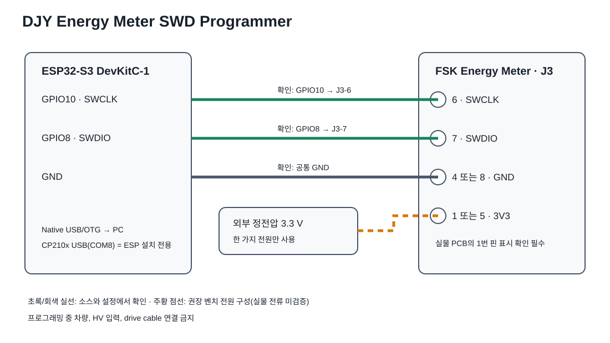

# ESP32-S3 ↔ FSK Energy Meter SWD 배선



## 필수 배선

| ESP32-S3 DevKitC-1 | Energy Meter J3 | 신호 | 상태 |
|---|---:|---|---|
| GPIO10 | 6 | SWCLK | 펌웨어 설정 및 원본 회로도에서 확인 |
| GPIO8 | 7 | SWDIO | 펌웨어 설정 및 원본 회로도에서 확인 |
| GND | 4 또는 8 | GND | 원본 회로도에서 확인 |
| 외부 정전압 3.3 V | 1 또는 5 | 3V3 | 벤치 전원 방식 제안, 실물 전류 미검증 |

Energy Meter J3 전체 핀맵은 원본 KiCad 회로도 기준으로 다음과 같습니다.

| J3 핀 | 신호 | J3 핀 | 신호 |
|---:|---|---:|---|
| 1 | 3V3 | 5 | 3V3 |
| 2 | USART1_RX | 6 | SWCLK |
| 3 | USART1_TX | 7 | SWDIO |
| 4 | GND | 8 | GND |

J3는 `2x4 Top/Bottom` 번호 방식입니다. 위 표의 논리 핀맵은 확인됐지만, 실물에서 어느 모서리가 1번인지는 PCB의 1번 패드/실크 표시로 반드시 확인해야 합니다.

## 전원과 USB

- 프로그래밍 중 차량 커넥터, HV 입력, drive cable은 연결하지 않습니다.
- Energy Meter에는 한 가지 전원만 사용합니다. 외부 3.3 V를 쓰는 동안 다른 LV/USB 전원을 동시에 넣지 않습니다.
- ESP의 3V3 핀으로 Energy Meter를 직접 공급하는 방법은 레귤레이터 여유 전류를 실물에서 확인하기 전까지 사용하지 않는 것을 권장합니다.
- ESP 펌웨어 설치: CP210x USB-UART 포트(COM8).
- CMSIS-DAP 사용: ESP32-S3 native USB/OTG 포트(GPIO19/20에 연결된 포트). GPIO19/20은 SWD 배선에 사용하지 않습니다.
- SWD 배선은 짧게 유지하고, 연결이 불안정하면 `flash_energy_meter.ps1`의 `-AdapterKhz 100`으로 낮춰 시험합니다.

## 최초 시험

전원과 핀 방향을 멀티미터로 확인한 다음, 기록 전에 아래 명령으로 STM32F401이 보이는지만 확인합니다.

```powershell
.\scripts\flash_energy_meter.ps1 -ProbeOnly
```
